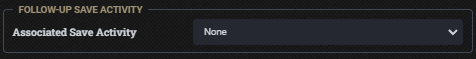
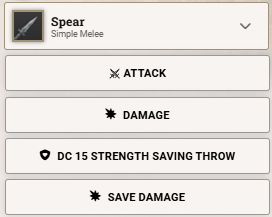

# DND5E Follow-up Save
Allows for selecting a "follow-up" Save activity on any Attack activity. If selected, the save's chat buttons will be added to the chat card when using the attack.

When enabled, a dropdown will appear on the "Effect" tab of your Attack activities:

If selected, the Attack activity's chat card will change to contain the relevant buttons (saves & damage):

## Incompatibilities:
- Anything that replaces the attack activity, probably.

#### Think this is neat?

